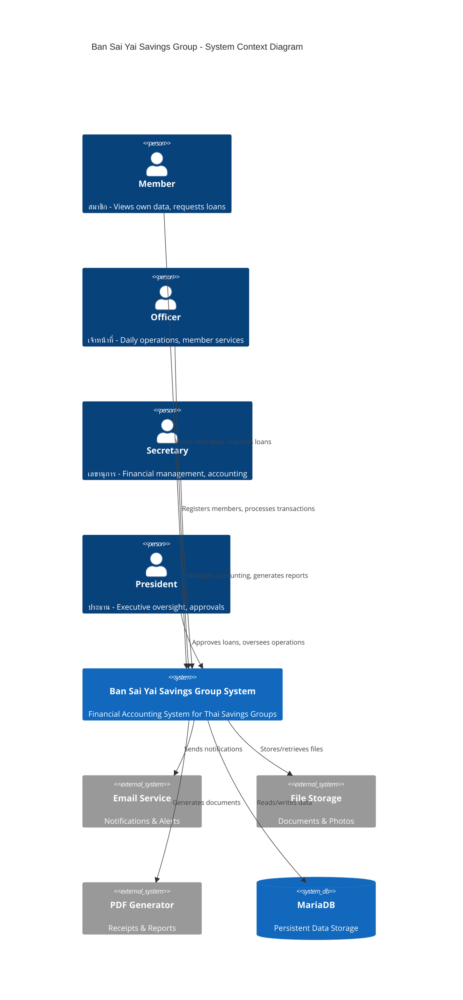
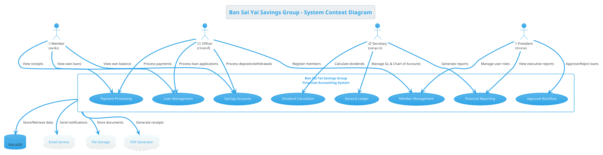

# Ban Sai Yai Savings Group - System Context Diagram

## Overview

This document presents the context diagram showing the interactions between the four user roles and the Ban Sai Yai Savings Group Financial Accounting System.

---

## Context Diagram (Text-based)

```
                                    ┌─────────────────────────┐
                                    │    External Systems     │
                                    │  • Email Notifications  │
                                    │  • File Storage         │
                                    │  • PDF Generation       │
                                    └───────────┬─────────────┘
                                                │
                                                ▼
    ┌────────────────────────────────────────────────────────────────────────────────┐
    │                                                                                │
    │                                                                                │
┌───┴───┐     ┌────────┐     ┌─────────────────────────────────────┐     ┌────────┐ │
│       │     │        │     │                                     │     │        │ │
│ MEMBER│◄───►│OFFICER │◄───►│    BAN SAI YAI SAVINGS GROUP       │◄───►│SECRETARY│ │
│       │     │        │     │    FINANCIAL ACCOUNTING SYSTEM      │     │        │ │
└───┬───┘     └────┬───┘     │                                     │     └────┬───┘ │
    │              │         │  ┌─────────────────────────────┐   │          │     │
    │              │         │  │ • Member Management         │   │          │     │
    │              │         │  │ • Savings Account           │   │          │     │
    │              │         │  │ • Loan Management           │   │          │     │
    │              │         │  │ • Payment Processing        │   │          │     │
    │              │         │  │ • Receipt Generation        │   │          │     │
    │              │         │  │ • Financial Reporting       │   │          │     │
    │              │         │  │ • Dividend Calculation      │   │          │     │
    │              │         │  │ • General Ledger            │   │          │     │
    │              │         │  └─────────────────────────────┘   │          │     │
    │              │         │                                     │          │     │
    │              │         └──────────────────┬──────────────────┘          │     │
    │              │                            │                             │     │
    │              │                            ▼                             │     │
    │              │                    ┌───────────────┐                     │     │
    │              │                    │   PRESIDENT   │                     │     │
    │              │                    │               │                     │     │
    │              │                    └───────────────┘                     │     │
    │              │                                                          │     │
    └──────────────┴──────────────────────────────────────────────────────────┴─────┘
                                                │
                                                ▼
                                    ┌─────────────────────────┐
                                    │       Database          │
                                    │       (MariaDB)         │
                                    └─────────────────────────┘
```

---

## Detailed Actor Interactions

### 1. 👤 MEMBER (สมาชิก)
**Role**: Limited self-service access

```
┌─────────────────────────────────────────────────────────────────┐
│                          MEMBER                                 │
├─────────────────────────────────────────────────────────────────┤
│                                                                 │
│  INPUTS (Data Flow INTO System)                                │
│  ─────────────────────────────                                 │
│  • Personal profile updates                                     │
│  • Loan application requests                                   │
│  • Deposit transactions                                        │
│  • Withdrawal requests                                         │
│                                                                 │
│  OUTPUTS (Data Flow FROM System)                               │
│  ──────────────────────────────                                │
│  • Personal profile information                                │
│  • Own loan status & balance                                   │
│  • Own savings account balance                                 │
│  • Own transaction history                                     │
│  • Own payment receipts (PDF)                                  │
│  • Dividend statements                                         │
│                                                                 │
└─────────────────────────────────────────────────────────────────┘
```

**API Endpoints Accessed:**
- `GET /api/members/me` - View own profile
- `GET /api/loans/my-loans` - View own loans
- `GET /api/savings/my-balance` - View savings balance
- `GET /api/transactions/my-history` - View transaction history
- `GET /api/receipts/my-receipts` - Download own receipts

---

### 2. 👨‍💼 OFFICER (เจ้าหน้าที่)
**Role**: Daily operational tasks and member services

```
┌─────────────────────────────────────────────────────────────────┐
│                          OFFICER                                │
├─────────────────────────────────────────────────────────────────┤
│                                                                 │
│  INPUTS (Data Flow INTO System)                                │
│  ─────────────────────────────                                 │
│  • New member registration data                                │
│  • Loan application processing                                 │
│  • Savings deposit/withdrawal transactions                     │
│  • Loan repayment entries                                      │
│  • Member document uploads                                     │
│  • Payment processing data                                     │
│                                                                 │
│  OUTPUTS (Data Flow FROM System)                               │
│  ──────────────────────────────                                │
│  • Member profiles (non-sensitive)                             │
│  • Loan application status                                     │
│  • Transaction confirmations                                   │
│  • Generated payment receipts (PDF)                            │
│  • Savings account statements                                  │
│  • Daily operation reports                                     │
│                                                                 │
└─────────────────────────────────────────────────────────────────┘
```

**API Endpoints Accessed:**
- `POST /api/members/register` - Register new members
- `POST /api/loans/apply` - Process loan applications
- `POST /api/savings/deposit` - Process deposits
- `POST /api/savings/withdraw` - Process withdrawals
- `POST /api/payments/process` - Process payments
- `POST /api/receipts/generate` - Generate receipts
- `GET /api/members/profile/{id}` - View member profiles

---

### 3. 📋 SECRETARY (เลขานุการ)
**Role**: Financial management and accounting operations

```
┌─────────────────────────────────────────────────────────────────┐
│                         SECRETARY                               │
├─────────────────────────────────────────────────────────────────┤
│                                                                 │
│  INPUTS (Data Flow INTO System)                                │
│  ─────────────────────────────                                 │
│  • Month-end closing commands                                  │
│  • Chart of Accounts updates                                   │
│  • Dividend calculation parameters                             │
│  • Journal entry adjustments                                   │
│  • Financial report requests                                   │
│  • Account code management                                     │
│                                                                 │
│  OUTPUTS (Data Flow FROM System)                               │
│  ──────────────────────────────                                │
│  • Balance Sheet reports                                       │
│  • Profit & Loss statements                                    │
│  • Trial Balance reports                                       │
│  • Cash Flow statements                                        │
│  • Dividend calculation results                                │
│  • General Ledger reports                                      │
│  • Financial data exports (Excel/PDF)                          │
│  • Audit trail reports                                         │
│                                                                 │
└─────────────────────────────────────────────────────────────────┘
```

**API Endpoints Accessed:**
- `GET /api/reports/financial` - Access financial reports
- `POST /api/accounting/close-month` - Month-end closing
- `GET /api/accounting/chart-of-accounts` - Manage Chart of Accounts
- `POST /api/dividends/calculate` - Calculate dividends
- `GET /api/transactions/all` - View all transactions
- `GET /api/reports/balance-sheet` - Balance sheet
- `GET /api/reports/profit-loss` - P&L statement
- `GET /api/reports/trial-balance` - Trial balance

---

### 4. 👔 PRESIDENT (ประธาน)
**Role**: Executive oversight and final approval authority

```
┌─────────────────────────────────────────────────────────────────┐
│                         PRESIDENT                               │
├─────────────────────────────────────────────────────────────────┤
│                                                                 │
│  INPUTS (Data Flow INTO System)                                │
│  ─────────────────────────────                                 │
│  • Loan approval/rejection decisions                           │
│  • Dividend approval decisions                                 │
│  • User role assignments                                       │
│  • System configuration changes                                │
│  • Penalty waiver authorizations                               │
│  • Policy override decisions                                   │
│                                                                 │
│  OUTPUTS (Data Flow FROM System)                               │
│  ──────────────────────────────                                │
│  • Executive dashboard                                         │
│  • All system reports                                          │
│  • Pending approval queue                                      │
│  • Member overview summaries                                   │
│  • Financial performance metrics                               │
│  • Audit logs and compliance reports                           │
│  • System configuration status                                 │
│                                                                 │
└─────────────────────────────────────────────────────────────────┘
```

**API Endpoints Accessed:**
- `GET /api/dashboard/executive` - Executive dashboard
- `PUT /api/loans/{id}/approve` - Approve loans
- `PUT /api/loans/{id}/reject` - Reject loans
- `GET /api/reports/summary` - Summary reports
- `POST /api/users/roles` - Manage user roles
- `GET /api/members` - View all members
- `GET /api/audit/logs` - Access audit logs

---

## Role Hierarchy & Permission Flow

```
                    ┌─────────────────────┐
                    │     PRESIDENT       │
                    │  (Full Authority)   │
                    └─────────┬───────────┘
                              │
            ┌─────────────────┼─────────────────┐
            │                 │                 │
            ▼                 ▼                 ▼
   ┌────────────────┐ ┌──────────────┐ ┌───────────────┐
   │   SECRETARY    │ │   OFFICER    │ │    MEMBER     │
   │  (Financial)   │ │ (Operations) │ │ (Self-Service)│
   └────────────────┘ └──────────────┘ └───────────────┘
            │                 │                 │
            │                 │                 │
            ▼                 ▼                 ▼
   ┌────────────────────────────────────────────────────┐
   │              System Functions                      │
   ├────────────────────────────────────────────────────┤
   │                                                    │
   │  ┌──────────┐ ┌──────────┐ ┌──────────┐           │
   │  │Financial │ │ Member   │ │ Loan     │           │
   │  │Reports   │ │ Mgmt     │ │ Processing│          │
   │  └──────────┘ └──────────┘ └──────────┘           │
   │                                                    │
   │  ┌──────────┐ ┌──────────┐ ┌──────────┐           │
   │  │Accounting│ │ Savings  │ │ Payments │           │
   │  │& GL      │ │ Accounts │ │& Receipts│           │
   │  └──────────┘ └──────────┘ └──────────┘           │
   │                                                    │
   │  ┌──────────┐ ┌──────────┐ ┌──────────┐           │
   │  │Dividends │ │ Approval │ │ Audit    │           │
   │  │Calc      │ │ Workflow │ │ Logs     │           │
   │  └──────────┘ └──────────┘ └──────────┘           │
   │                                                    │
   └────────────────────────────────────────────────────┘
```

---

## Data Flow Summary Table

| Actor | Can Read | Can Create | Can Update | Can Delete | Can Approve |
|-------|----------|------------|------------|------------|-------------|
| **MEMBER** | Own data only | Loan requests | Own profile | ❌ | ❌ |
| **OFFICER** | Member profiles | Members, Deposits, Payments | Member data, Transactions | ❌ | ❌ |
| **SECRETARY** | All financial data | Journal entries, Reports | Chart of Accounts, Closing | ❌ | ❌ |
| **PRESIDENT** | All system data | User roles, Config | All records | Policy override | Loans, Dividends |

---

## External System Interactions

```
┌─────────────────────────────────────────────────────────────────┐
│                    EXTERNAL SYSTEMS                             │
├─────────────────────────────────────────────────────────────────┤
│                                                                 │
│  ┌─────────────────┐                                           │
│  │  Email Service  │◄──── Notifications, Alerts, Statements    │
│  └─────────────────┘                                           │
│                                                                 │
│  ┌─────────────────┐                                           │
│  │  File Storage   │◄──── Member documents, Photos, Reports    │
│  └─────────────────┘                                           │
│                                                                 │
│  ┌─────────────────┐                                           │
│  │ PDF Generation  │◄──── Receipts, Statements, Reports        │
│  └─────────────────┘                                           │
│                                                                 │
│  ┌─────────────────┐                                           │
│  │ MariaDB Database│◄──── All persistent data storage          │
│  └─────────────────┘                                           │
│                                                                 │
└─────────────────────────────────────────────────────────────────┘
```

---

## Mermaid Diagram (For rendering tools)



---

## PlantUML Diagram



---

## Summary

The Ban Sai Yai Savings Group system implements a **Role-Based Access Control (RBAC)** model with four distinct user roles:

| Role | Thai Name | Primary Responsibility |
|------|-----------|----------------------|
| **PRESIDENT** | ประธาน | Executive oversight, final approvals, policy decisions |
| **SECRETARY** | เลขานุการ | Financial management, accounting, reporting |
| **OFFICER** | เจ้าหน้าที่ | Daily operations, member services, transactions |
| **MEMBER** | สมาชิก | Self-service access to own data only |

The system manages:
- **Member Management** - Registration, profiles, documents
- **Savings Accounts** - Deposits, withdrawals, balances
- **Loan Management** - Applications, processing, tracking
- **Payment Processing** - Repayments, receipts, penalties
- **Financial Reporting** - Balance sheet, P&L, trial balance
- **Dividend Calculation** - Annual profit distribution
- **General Ledger** - Chart of accounts, journal entries
- **Approval Workflow** - Multi-level loan approvals
